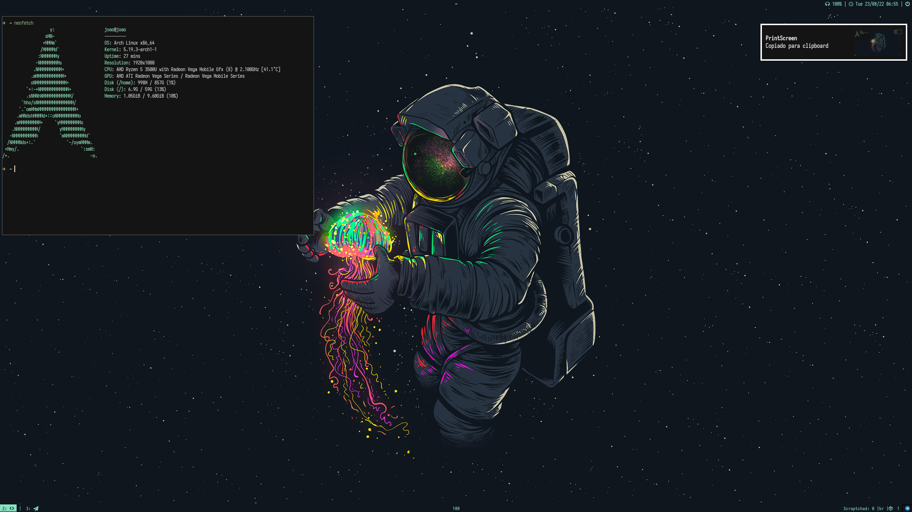
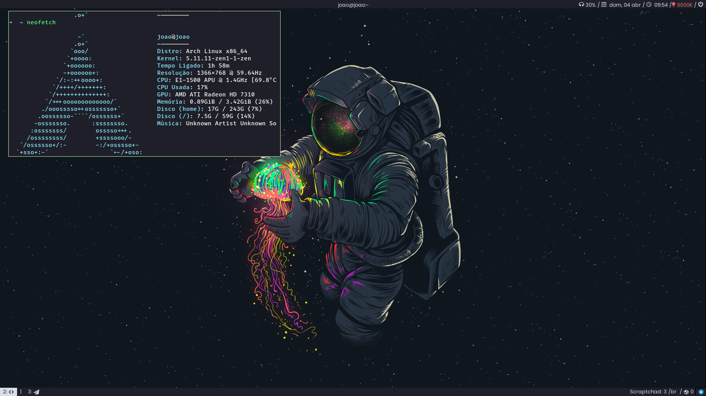

[Guia-Arch](https://github.com/JoaoPedroPierri/dotfiles/blob/master/Arch%20Guia.md)

# ***`CURRENT SETUP:`***
| Tipos               | Softwares                                                                                                                           |
| :------------------ | :---------------------------------------------------------------------------------------------------------------------------------- |
| Linux distribution        | [Arch Linux](https://wiki.archlinux.org/index.php/Installation_guide_(Portugu%C3%AAs))                                                                                            |                                                                                       
| Window Manager  | [i3](https://github.com/Airblader/i3)                                                                                             
| Browser           | [Google Chrome](https://aur.archlinux.org/packages/google-chrome/)                                                                                |
| Program Launcher | [Rofi](https://github.com/davatorium/rofi)                                                                                         |           
| Status Bar     | [Polybar](https://github.com/polybar/polybar)                                                                                         |     									    |                                					     	 	    
| Vídeo Player        | [MPV](https://mpv.io/)														    |
| Music Player | [Spotify](https://flathub.org/apps/details/com.spotify.Client)                   								    |
| Image viewer | [Viewnior](http://siyanpanayotov.com/project/viewnior)                                                                                                                                                                                             
| Print Screen     | [Import](https://github.com/JoaoPedroPierri/dotfiles/blob/master/bin/shot)                                                                               |
| Terminal Emulator   | [Kitty](https://github.com/kovidgoyal/kitty)                                                                                 |
| Shell               | [ZSH](https://wiki.archlinux.org/index.php/Zsh)                                                                                                         
| Text editor     | [NeoVim](https://github.com/neovim/neovim)                                                    							    |
| Lockscreen    | [Fortune.sh](https://github.com/JoaoPedroPierri/dotfiles/blob/master/.config/polybar/scripts/fortune.sh)                                                                                                  
| Notification Daemon   | [Dunst](https://github.com/dunst-project/dunst)                                                                                    
| Development   | [NeoVim](https://github.com/neovim/neovim)

# [i3Install](https://github.com/JoaoPedroPierri/Arch Guia)

# i3 Gaps

